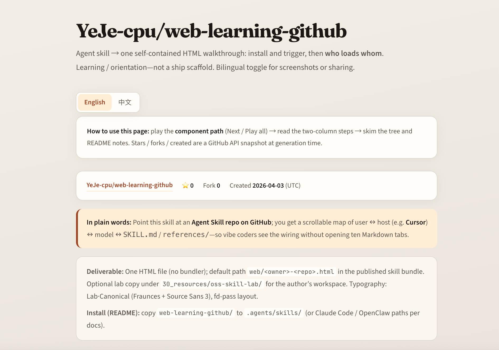
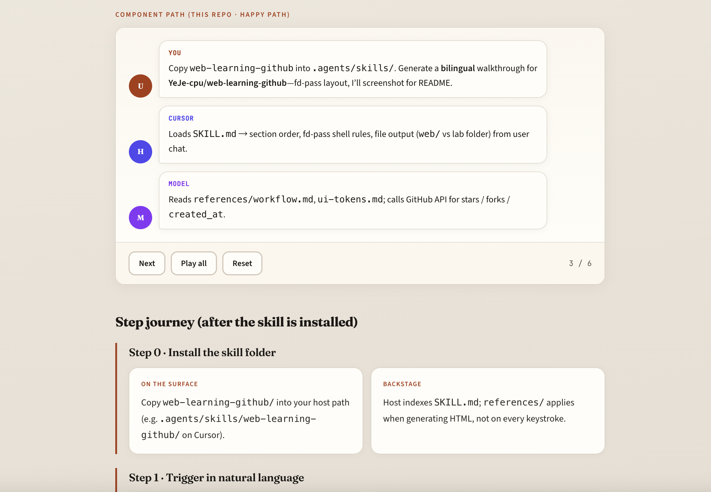
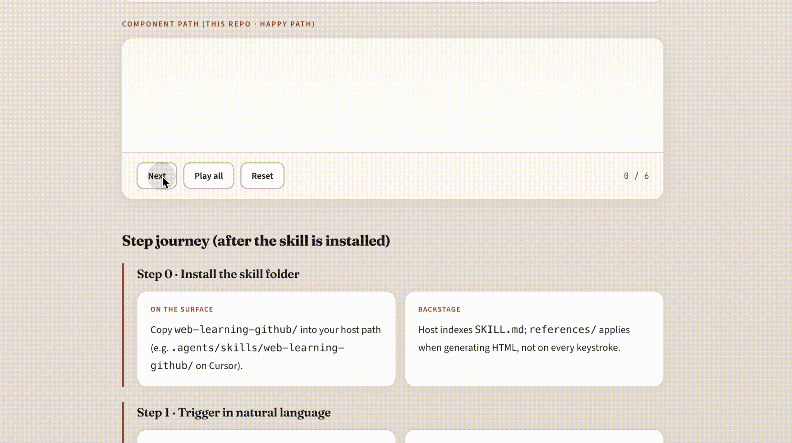

# Web Learning GitHub

An agent skill for Cursor, Claude Code, Windsurf, OpenClaw, and similar hosts. Point it at an Agent Skill repo on GitHub: you get a single self-contained HTML file that traces the UI/UX path—what you do in the product, and what the host, model, and agents do underneath. Meant for learning and getting oriented, not for turning code into a shipped web app.

中文说明：[README.zh-CN.md](README.zh-CN.md) · Repository: [YeJe-cpu/web-learning-github](https://github.com/YeJe-cpu/web-learning-github)

## Demo (what you get)

Below is the **English** walkthrough for this repo, generated as [`web/YeJe-cpu-web-learning-github.html`](web/YeJe-cpu-web-learning-github.html). Clone and open locally; **English / 中文** toggle at the top, **Next · Play all · Reset** on the component path.







---

## Who is this for?

Vibe coders and anyone browsing GitHub who want to understand how a skill repo is wired: where to install it, what triggers it, and which files load in what order.

Also useful when the README is high-level but the real entrypoints live under hooks, `references/`, or subcommands—you get one scrollable page instead of many small Markdown hops.

---

## What the page looks like

Output is one HTML file (no bundler). Typical sections:

- Repo meta (link, stars, forks, created time; optional snapshot note in the footer)
- Short plain-language intro
- Step-through component path (user → host → which `SKILL.md` / `references/` → next agent step)—length follows the real repo
- Surface vs backstage steps for each phase
- Repository tree
- Short README context bullets (demand, spread, caveats)
- Typography and layout follow our default design token Lab·Canonical (warm editorial style); ideas align with [Anthropic frontend-design](https://github.com/anthropics/skills/tree/main/skills/frontend-design). First load may fetch Google Fonts; after that it can work offline from cache.

A shorter bilingual sample lives at [`web/demo.html`](web/demo.html). For the full fd-pass layout (as in the screenshots), use **`web/YeJe-cpu-web-learning-github.html`**.

---

## How to use

1. Copy the `web-learning-github` folder into your host’s skills directory (examples below).
2. In chat, ask for an HTML walkthrough of a repo (see trigger phrases).

| Host | Typical path |
|------|----------------|
| Cursor | e.g. `.agents/skills/web-learning-github/` in the project |
| Claude Code | e.g. `~/.claude/skills/web-learning-github/` |
| Windsurf | follow current product docs |
| OpenClaw | e.g. `~/.openclaw/skills/` or workspace `skills/` — [OpenClaw · Skills](https://docs.openclaw.ai/skills/) |

Generated pages default to `web/<owner>-<repo>.html`. You can override the folder in the prompt. Output language (or a bilingual toggle in one file) is described in `SKILL.md` and `SKILL.zh-CN.md`.

### Trigger phrases

- “Turn `owner/repo` into one HTML that maps install → trigger → file order.”
- “Component path first as bubbles, then surface vs backstage steps.”
- “One HTML with EN / 中文 toggle for every section.”
- 「把这个仓库做成一页路径说明 HTML。」

---

## Design philosophy

Path before long prose. Prefer a step-through call graph over walls of text. One file you can share or archive.

---

## Skill layout

```
web-learning-github/
├── SKILL.md
├── SKILL.zh-CN.md
├── references/
├── assets/             # README demo images
├── web/
│   ├── demo.html
│   └── YeJe-cpu-web-learning-github.html
├── README.md
├── README.zh-CN.md
└── LICENSE
```

Details for `references/` are in [`references/README.md`](references/README.md).

---

## Acknowledgements

[zarazhangrui/codebase-to-course](https://github.com/zarazhangrui/codebase-to-course) (*Codebase to Course*) turns application codebases into rich, interactive single-page courses (modules, quizzes, visualizations)—a different and valuable problem. We borrow the idea of putting a clear **component path / timeline** up front; our focus is Agent Skill repos and a single-page map of user action vs agent behavior, without a mandatory course loop. Both can coexist. If our comparison misstates their current README, open an issue.

| | Codebase to Course | Web Learning GitHub |
|---|---|---|
| Typical input | Application / product repos | Skill bundles (`SKILL.md`, hooks, `references/`) |
| Experience shape | Course-style depth | One-page overview |
| Shared idea | Clear ordering of who loads whom | Same: step-through path first |
| Emphasis here | — | User step ↔ model/agent; meta, tree, README hints on one page |

---

## License

MIT — see [LICENSE](LICENSE).

## Contributing

[CONTRIBUTING.md](CONTRIBUTING.md).
