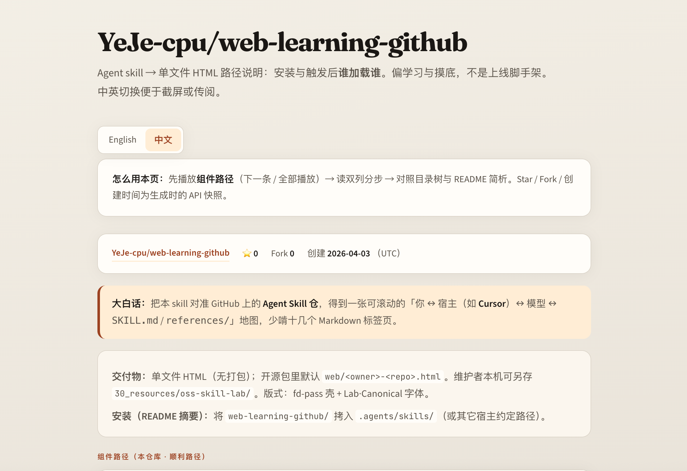
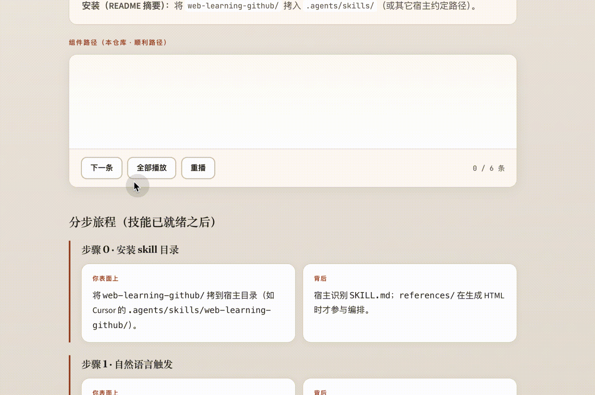
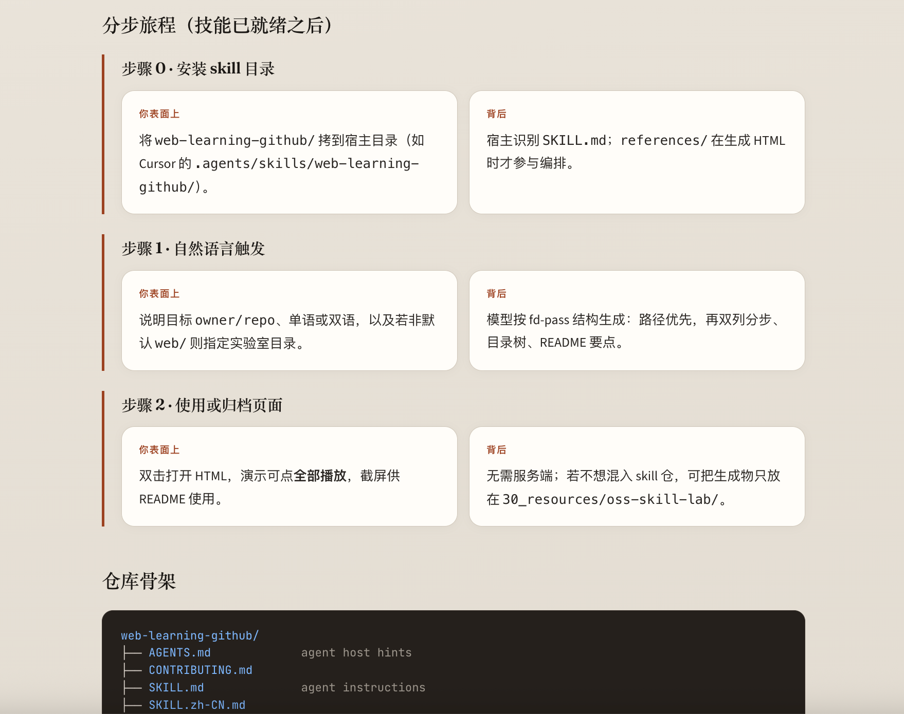

# Web Learning GitHub

## 这是啥，适合谁

跑在 **Cursor、Claude Code、Windsurf、OpenClaw** 等环境里的 Agent skill：对准 GitHub 上的 **Agent Skill 仓库**，生成 **单个自包含 HTML**，沿「你怎么操作」和「宿主 / 模型在背后读什么」把路径铺开——适合 **学习与捋清调用关系**，不是把业务代码一键变成上线网站。

**适合谁？** Vibe coder、常刷 GitHub、想搞清某个 skill 仓 **怎么装、怎么触发、文件谁先谁后** 的人。README 往往写得很概括，真实入口在 Hook、`references/` 或子命令里；这一页用 **可滚动的单文件** 把路径和幕后机制放在一起，少啃一堆 Markdown 标签页。

English：[README.md](README.md) · 仓库：[YeJe-cpu/web-learning-github](https://github.com/YeJe-cpu/web-learning-github)

---

## 演示 & 生成的页面里有什么

下列截图为 **本仓库** 示例 [`web/YeJe-cpu-web-learning-github.html`](web/YeJe-cpu-web-learning-github.html) 的 **中文** 界面（克隆后本地打开）。与 [codebase-to-course](https://github.com/zarazhangrui/codebase-to-course) 一类 README 相同：**一段说明 + 一张图**，逐屏展示。页顶 **English / 中文**；组件路径 **下一条 · 全部播放 · 重播**（fd-pass）。

**总览 — 提示卡、仓库信息、大白话与交付物**



**组件路径交互（GIF）**



**分步旅程双列 + 目录树**



**这一页里通常包括：** 仓库 meta（链接、Star、Fork、创建时间）、大白话、**可步进的组件路径**（步数随真实仓库，非固定条数）、**宽屏双列**「表面上 / 背后」、目录树、README 式要点。默认视觉 **Lab·Canonical**（暖色、清晰版心），纪律上可参考 [Anthropic frontend-design](https://github.com/anthropics/skills/tree/main/skills/frontend-design)。首次若拉 Google Fonts 需联网，之后可离线依赖缓存。

更短的示例见 [`web/demo.html`](web/demo.html)。与截图一致的完整 walkthrough 即 **`web/YeJe-cpu-web-learning-github.html`**。

---

## 怎么用

1. 将 `web-learning-github` 文件夹拷入宿主规定的 skills 目录（见下表）。
2. 在对话里说明要对哪个仓库生成 HTML（见触发示例）。

| 宿主 | 常见路径 |
|------|-----------|
| Cursor | 如 `.agents/skills/web-learning-github/` |
| Claude Code | 如 `~/.claude/skills/web-learning-github/` |
| Windsurf | 以官方文档为准 |
| OpenClaw | 如 `~/.openclaw/skills/` 或工作区 `skills/`，见 [OpenClaw · Skills](https://docs.openclaw.ai/skills/) |

默认保存为 `web/<owner>-<repo>.html`，可在提示里改目录。整页语言或「单文件内中英切换」见 `SKILL.md` / `SKILL.zh-CN.md`。

### 触发示例

- 「把 `owner/repo` 做成一页：安装 → 触发 → 读文件顺序。」
- 「组件路径用气泡步进，再写表面上/背后。」
- 「一个 HTML，顶部中英切换，段落双语。」
- “Turn `owner/repo` into one HTML with EN/中文 toggle.”

---

## 设计理念

先路径、后长文；能步进就不堆大段；单文件好分享。

---

## 目录结构

```
web-learning-github/
├── SKILL.md
├── SKILL.zh-CN.md
├── references/
├── assets/             # README 演示配图
├── web/
│   ├── demo.html
│   └── YeJe-cpu-web-learning-github.html
├── README.md
├── README.zh-CN.md
└── LICENSE
```

`references/` 说明见 [`references/README.md`](references/README.md)。

---

## 致谢

[zarazhangrui/codebase-to-course](https://github.com/zarazhangrui/codebase-to-course)（Codebase to Course）把应用代码仓做成互动单页「课程」，模块与可视化都很完整，是很好的参照。我们借鉴的是「把时间线上谁先加载谁讲清楚」这一点；定位侧重点是 Agent Skill 包与用户—Agent 路径的一页地图，不强调课堂闯关。两者互补。若我们对上游描述过时，欢迎开 issue。

| | Codebase to Course | Web Learning GitHub |
|---|---|---|
| 典型输入 | 应用 / 产品代码仓 | 技能包（`SKILL.md`、Hook、`references/` 等） |
| 体验形态 | 课程式深度 | 单页总览 |
| 共同点 | 清晰的组件路径与时间线 | 同样把步进路径放在靠前位置 |
| 我们侧重的 | — | 用户操作与模型/Agent 的对照；元信息、树、README 提示同页呈现 |

---

## 许可证

MIT — 见 [LICENSE](LICENSE)。
